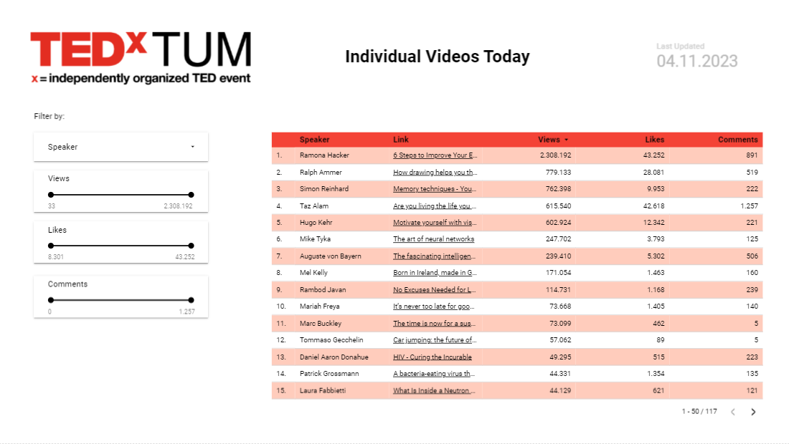
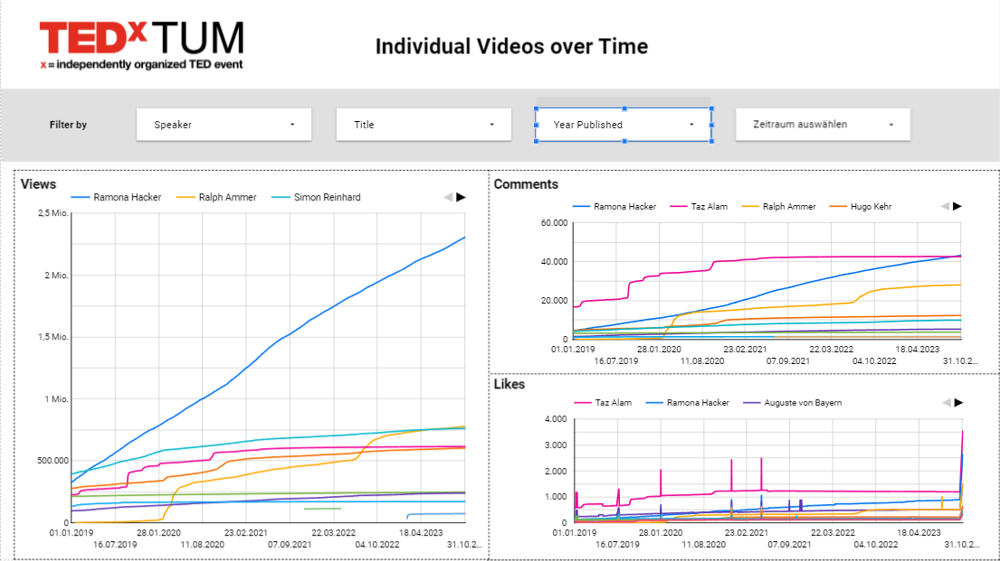

# TEDx-YTT
A youtube tracker (YTT) for TEDx videos that tracks the performance of all videos filmed at a specific TEDx
over time using the YoutTube API v2. Each run saves the current likes, views, comments of all videos so historical data
can be tracked and analyzed.

A version of this script has been collecting data for TEDxTUM for ~5 years now. 
A webdashboard showing historical video views, likes and comments can be accessed [here](https://lookerstudio.google.com/reporting/154a6446-1fb1-4ecb-b941-aa4ed164ea83).
Example Reports that can be generated in Looker studio using the data connection to BigQuery:



## Table of Contents
1. [Overview](#overview)
   - [YouTube Video Search](#youtube-video-search)
   - [Data Retrieval](#data-retrieval)
   - [Data Storage](#data-storage)
   - [Data Analysis](#data-analysis)
   - [File Management](#file-management)
   - [Pub/Sub Trigger](#pubsub-trigger)
   - [BigQuery Integration](#bigquery-integration)
   - [Script Versions](#script-versions)
2. [Google Cloud Project Setup](#google-cloud-project-setup)
   - [Google Cloud Function](#google-cloud-function)
   - [Cloud Scheduler and Pub/Sub](#cloud-scheduler-and-pubsub)
   - [Cloud Storage](#cloud-storage)
   - [BigQuery](#bigquery)
   - [LookerStudio (BI Dashboard)](#lookerstudio-bi-dashboard)
3. [Steps to Get TEDxYTT Running on GCP](#steps-to-get-tedxytt-running-on-gcp)
4. [Dependencies](#dependencies)
5. [Contributing](#contributing)
6. [Authors](#authors)
7. [License](#license)
8. [Acknowledgments](#acknowledgments)

## Overview

The script performs the following tasks:
1. **YouTube Video Search:** It uses the YouTube Data API to search for YouTube videos on the [TEDxTalks channel](https://www.youtube.com/user/TEDxTalks/) based on a specified  `SEARCH_TERM` (e.g. the TEDx name) . The search results are retrieved and processed to obtain video IDs.
2. **Data Retrieval:** For each video ID obtained from the search, the script fetches detailed information about the video, including its title, speaker name, views, likes, dislikes, comments.
3. **Data Storage:** The script stores the collected data in Google Cloud Storage, both as raw output data (file `[BASE_FILENAME]-output.csv`) and statistical data (file `[BASE_FILENAME]-statistics.csv`).
4. **Data Analysis:** It can calculate statistics (e.g., using the describe function) on numeric columns and stores them separately.
5. **File Management:** The script includes functions to rename and manage files in Google Cloud Storage, ensuring that file sizes do not become excessively large over time.
6. **Pub/Sub Trigger:** The script can be triggered by Pub/Sub messages, making it suitable for scheduled or event-driven execution.
7. **BigQuery Integration:** It uploads the collected data to BigQuery tables, allowing for further analysis and querying, e.g. using LookerStudio.

There are two versions of the script extracting the data
1. local - that is intended to run locally on your machine or server
2. Google Cloud - that is intended to be used in the Google Cloud

As of today (2023), the Google Cloud (GCP) version is the recommended and maintained version.
The local version (including data visualization scripts and a web dashboard) is provided in the `local` directory
in this repository. The Google Cloud version is provided in the `Google Cloud` directory and includes the necessary 
requirements.txt and main.py to be run as a Cloud Function on GCP

## Google Cloud Project Setup

### Google Cloud Function

- **Functionality:** The script responsible for scraping data from the YouTube API is designed to run as a [Google Cloud Function](https://cloud.google.com/functions).

- **Purpose:** Google Cloud Functions allow for serverless execution of code, making it an ideal choice for automating the data collection process.

- **Environment Variables:** All the essential information required for the script's operation, including the YouTube API Key, is securely stored within the environment variables of the Cloud Function. This ensures that sensitive information remains protected.

### Cloud Scheduler and Pub/Sub

- **Trigger Mechanism:** To initiate the execution of the script, a [Cloud Scheduler Job](https://cloud.google.com/scheduler) is used as the trigger. This job is configured to take a specific action: publishing a message to a [Pub/Sub](https://cloud.google.com/pubsub) topic.

- **Message Payload:** The Pub/Sub action sends a message with a payload, which can be either "update" or "search." The choice of payload determines the script's behavior. If "update" is sent, the script updates existing data; if "search" is sent, the script searches for new videos.

### Cloud Storage

- **Data Storage:** The collected data, in the form of CSV files, is saved on [Google Cloud Storage](https://cloud.google.com/storage).

- **Purpose:** Google Cloud Storage is used to securely store and manage the data collected from YouTube. The files can be accessed and shared as needed, and they are readily available for further analysis.

### BigQuery

- **Data Warehouse:** The data collected from YouTube is written to a table within a dataset on [Google BigQuery](https://cloud.google.com/bigquery).

- **Data Analysis:** BigQuery provides powerful querying and data analysis capabilities. The collected data is structured and stored for analysis, reporting, and generating insights.

### LookerStudio (BI Dashboard)

- **BI Dashboard:** The BigQuery dataset containing the YouTube data is connected to [LookerStudio](https://looker.com/platform/google-cloud). LookerStudio is a Business Intelligence (BI) platform that allows the creation of accessible dashboards and reports.

- **Accessibility:** The BI dashboard created in LookerStudio is accessible through a web interface, enabling users to interact with the data and gain insights.

- **Embeddable:** The LookerStudio dashboard can be embedded on your webpage, making it accessible to a wider audience and seamlessly integrating data insights into your online presence.

By utilizing these Google Cloud Platform (GCP) products, you can automate YouTube data collection, securely store and analyze the data, and present insights through an accessible BI dashboard, thereby facilitating informed decision-making and enhancing the user experience.


## Steps to get TEDxYTT running on GCP
The following outlines the steps to be taken to manually set up TEDxYTT. Plans for the future include IaaS and CloudBuild code so this can be done in a few simple steps.
Until then: 
1. Set up a GCP Project including an associated payment account. The project will result in costs that have to be tracked regularily. (From experience, they are <1 USD per month)
2. Activate the **YouTube API v2** for this project
3. Copy the API key and safe it as secret in the **SecretManager**. Save the name of the secret where you can find it (will be needed for environment variables) this is to make sure you don't accidentally share your API with the public.
4. Set up a **PUB/SUB** topic
5. Set up a bucket (i.e. folder) in google **Cloud Storage** and save the name somewhere you can find it (will be needed for environment variables later). This is where the csv files will go and where the youtube IDs will be saved.
6. Set up a **BigQuery** dataset including the two tables 'data-all' and 'stats-all'. They can be empty. Make sure to pick the same region as for google cloud storage (and later cloud function)
7. Add `main.py` and `requirements.txt` to a zip and use this to set up a **CloudFunction**. Use the previously created PubSub as **Eventarc**-Trigger. Depending on the amount of videos you already published, you may need to set the RAM higher than the minimum (512 MiB should work for most, many will make due with 256 MiB). You also have to set the following environment variables:

| Name            | Value                                       | Description |
|-----------------|---------------------------------------------| ----------- |
| GCP_BUCKET_NAME | Name of the bucket created in step 5        | csv files and YouTube Ids will be saved here.
| SEARCH_TERM     | Your TEDx's name, e.g. TEDxTUM              | Tells the script which term to search for. Will automatically also search for combinations of SEARCHTERM and Women, Salon and Youth.
| SEARCH          | True or False                               | Determines whether new videos will be searched or not. Is overwritten by the payload of your pubsub message (see below)
| MAX_RESULTS     | a number 1-1000                             | Maximum results analyzed from youtube search with `SEARCH_TERM`. Every API call returns 50 results, i.e. multiples of 50 make sense. You may run into quota issues with too high numbers (400 works just fine)
| UPDATE          | True or False                               | Defines whether `[BASE_FILENAME]-output` and `[BASE_FILENAME]-stastics` are updated with new data from youtube. Set to `False` if you only want to run statistics on an old file without updating it with new data.
| BASE_FILENAME   | string                                      | Defines how `[BASE_FILENAME]-output` and `[BASE_FILENAME]-stastics` are named.
| NEWOUTPUT_WEEKDAY | a day between monday-sunday                 | Day of the week at which the current output file is renamed into `[BASE_FILENAME]-output_week[calendarweek]`
| NEWSTATS_DAY    | a number between 1-27                       | Day of the month at which the current statistics file is renamed into  `[BASE_FILENAME]-stastics_[current month]`
| GCP_SECRET | ID of the the secret generated in 3.        | Location of the YouTube API Key, that the scrip should use
| ALLTABLE| name of the `all-data` table generated in 6 | Script writes data to this SQL database
|STATSTABLE| name of the `all-data` table generated in 6 | Script writes calculated statistics to this SQL database

Set the entry point for the Cloud Function to `trigger_pubsub`
8. Set up your **CloudScheduler** to post either 'update' or 'search' to the pubsub topic defined in step 4. Cloud Scheduler follows Cron Syntax:
```
# * * * * * 
# ┬ ┬ ┬ ┬ ┬
# │ │ │ │ │
# │ │ │ │ │
# │ │ │ │ └───── day of week (0 - 7) (0 to 6 are Sunday to Saturday, or use names; 7 is Sunday, the same as 0)
# │ │ │ └────────── month (1 - 12)
# │ │ └─────────────── day of month (1 - 31)
# │ └──────────────────── hour (0 - 23)
# └───────────────────────── min (0 - 59
```
E.g. to post the message each day of the week at 7 am, you would add a Job with time '0 7 * * *'. For each monday at 9:05 am you would use '5 9 * * 1'
9. Wait for the first execution of the function or go to **Cloud Scheduler**, select the job that includes search and click "Force Execution". Check in BigQuery whether the tables are filled (you can check the "schema" if its not empty, theres data)
10. Use LookerStudio to set up a Dashboard.


# Dependencies

The script relies on the following Python libraries and modules:

- `base64`: For encoding and decoding data.
- `datetime`: For working with date and time.
- `os` and `sys`: For system-related operations.
- `pandas`: For data manipulation and storage.
- `google-cloud` libraries: For interacting with Google Cloud services, including Google Cloud Storage and BigQuery.
- `googleapiclient.discovery`: For accessing the YouTube Data API.
- `io.StringIO`: For reading and writing strings as file-like objects.
- `pandas_gbq`: For working with Google BigQuery.

# Contributing
If you want to contribute to the improvement of TEDx-YTT, please have a look [here](../CONTRIBUTING.md)


# Authors

* **[Julian M. Dlugosch](https://github.com/JuMaD)** - *Initial work* 
* **[Dora Dzvonyar](http://dzvonyar.com/)**&nbsp;&nbsp;&nbsp;&nbsp;&nbsp;&nbsp;&nbsp; - 
*Code and Documentation Review* 

See also the list of [contributors](https://github.com/JuMaD/TEDx-YTT/graphs/contributors) 
who participated in this project.

# License

This project is licensed under the MIT License - 
see the [LICENSE.md](https://github.com/JuMaD/TEDx-YTT/blob/master/LICENSE) file for details

# Acknowledgments

* TEDxWilmington for the idea to built a tracker based on the Youtube Data API: [Listen to the Hacking the Red Circle Episode](https://www.stitcher.com/podcast/hacking-the-red-circle/e/56498580)
